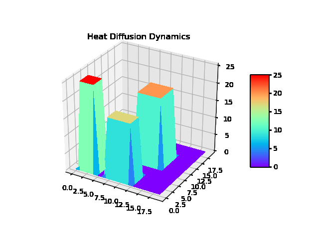
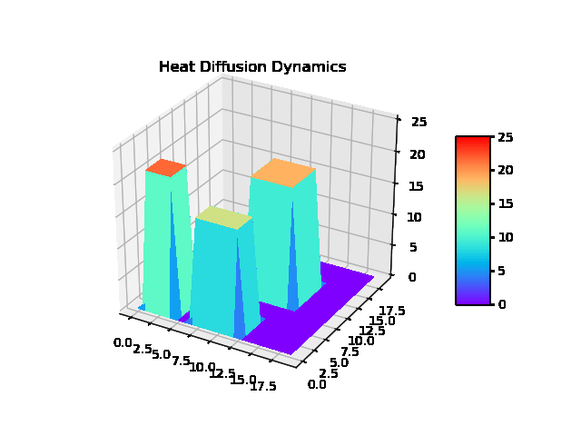

# Neural Dynamics on Complex Networks

Please refer to our paper:

Zang, Chengxi, and Fei Wang. "Neural dynamics on complex networks." In Proceedings of the 26th ACM SIGKDD International Conference on Knowledge Discovery & Data Mining, pp. 892-902. 2020.
```
@inproceedings{zang2020neural,
  title={Neural dynamics on complex networks},
  author={Zang, Chengxi and Wang, Fei},
  booktitle={Proceedings of the 26th ACM SIGKDD International Conference on Knowledge Discovery \& Data Mining},
  pages={892--902},
  year={2020}
}
```
## Install libs:
```
conda create --name ndcn 
conda activate ndcn
conda install pytorch torchvision cudatoolkit=10.2 -c pytorch 
conda install networkx 
conda install matplotlib 
conda install scipy
conda install scikit-learn
conda install pandas
torchdiffeq in https://github.com/rtqichen/torchdiffeq
```
<!-- --network community --dump --sampled_time equal --baseline ndcn --gpu -1 --weight_decay 1e-4 -->

## Learning continous-time or regularly-sampled graph dynamics

### NDCN for mutualistic interation dynamics 
Python files: mutualistic_dynamics.py
```
python mutualistic_dynamics.py  --T 5 --network grid --dump --sampled_time irregular --baseline ndcn --viz --gpu -1 --weight_decay 1e-2
```
--network *** for underlining graph with choices=['grid', 'random', 'power_law', 'small_world', 'community']<br /> 
--sampled_time ** for irregularlly-sampled graph dynamics or regularly sampled ones with choices=['irregular', 'equal']<br /> 
--baseline ** chooses any model from choices=['ndcn', 'no_embed', 'no_control', 'no_graph', 'lstm_gnn', 'rnn_gnn', 'gru_gnn']<br /> 
Please refer to the code for the detailed parameter choices


### Similar commands for heat-diffusion dynamics or gene regulatory dynamics
Python files: heat_dynamics.py and gene_dynamics.py
```
python heat_dynamics.py  --T 5 --network grid --dump --sampled_time irregular --baseline ndcn --viz --gpu -1 --weight_decay 1e-3
python gene_dynamics.py  --T 5 --network grid --dump --sampled_time irregular --baseline ndcn --viz --gpu -1 --weight_decay 1e-4
```

### Refer to Animations in gif folder
#### Heat Diffusion on a Grid Graph, Ground Truth


#### Heat Diffusion on a Grid Graph Learned by our NDCN model


3 dynamics (gene, heat, mutualistic dynamics) on 5 graphs (grid', 'random', 'power_law', 'small_world', 'community' graphs) are shown in gif folder, 
or
download our ppt  https://drive.google.com/file/d/1KBl-6Oh7BRxcQNQrPeHuKPPI6lndDa5Y and show in full screen to check our compiled animations.

## Semisupervised learning on graphs by our continuous-time GNN model:
--iter 100 experiments:
```
python dgnn.py --dataset cora  --model  differential_gcn --iter 100   --dropout 0 --hidden 256 --T 1.2 --time_tick 16 --epochs 100 --dump --weight_decay 0.024 --no_control --method dopri5 --alpha 0
```

a showcased results by my laptop for --iter 5 experiments:
```
Total time: 772.3850s;
results: 83.180% (mean) +/- 0.756% (std), 83.000% (median);
Min_Acc: 82.600%, Max_Acc: 84.500%
{'no_cuda': False, 'fastmode': False, 'seed': -1, 'epochs': 100, 'rtol': 0.1, 'atol': 0.1, 'lr': 0.01, 'weight_decay': 0.024, 'nHiddenLayers': 0, 'hidden': 256, 'dropout': 0.0, 'dataset': 'cora', 'model': 'differential_gcn', 'iter': 5, 'dump': True, 'delta': 1.0, 'sms': False, 'normalize': False, 'Euler': False, 'T': 1.2, 'time_tick': 16, 'no_control': True, 'method': 'dopri5', 'alpha': 0.0, 'cuda': False}
```
